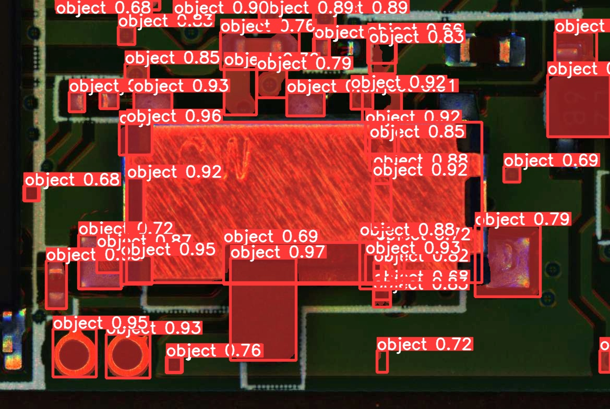
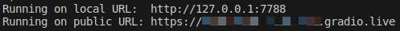
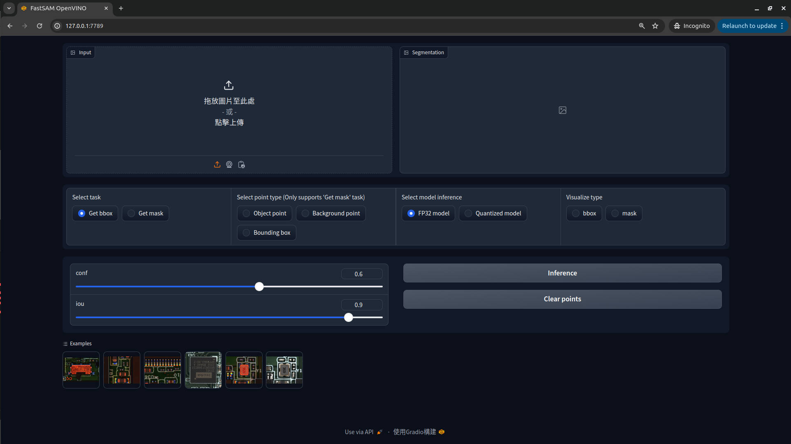

# FastSAM-OV
**FastSAM inference tool, and speed up with OpenVINO**

## Pre-requirement
* [Docker 20.10 + ](https://docs.docker.com/engine/install/ubuntu/)

## Build Environment
* Docker Image
    ```bash
    cd docker
    docker build -t fastsam_ov .
    ```

## Getting Start
* Launch Docker container
    ```bash
    docker run -it --name fastsam \
                --net=host --privileged \
                -v $(pwd):/workspace fastsam_ov bash
    ```
* CLI
    ```bash
    python3 cli.py --img {path_to_src}

    # add args --quantize, if you want to use the Quantized model
    ```
    * The predict result
    
* Quantize model (Optional)
    ```bash
    python3 quantize/do_quantize.py --ov_model_path {path_to_openvino_FP32_xml_file}

    # The file will save at FastSAM-x_quantized_model
    ```
* Web demo
    >**NOTE: If you want to use quantized model, step "Quantize model" must be completed first.**

    **Start the FP32 model**
    ```bash
    python3 web_demo.py

    # add args --quantize, if you want to start the FP32 and Quantized models at the same time
    ```
    **Open website**
    * After launch web_demo.py, you will receive below information
    
    * Web DEMO Interface
    